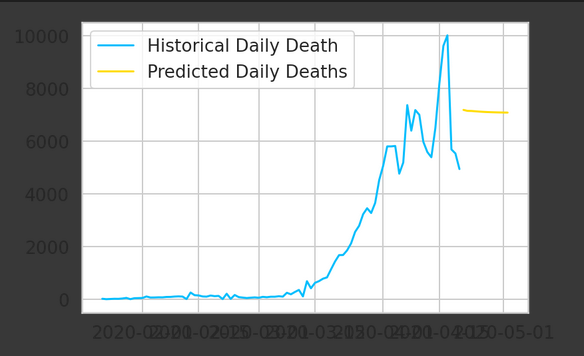

# COVID19-Death-rate
A Pytorch time series model that predicts deaths from COVID19 using LSTMs

As we can see, the trend is unusual. Outbreaks like COVID are highly unpredictable. Lying around the graph as it proceeds gives a good of such series which, we have accomplished !
